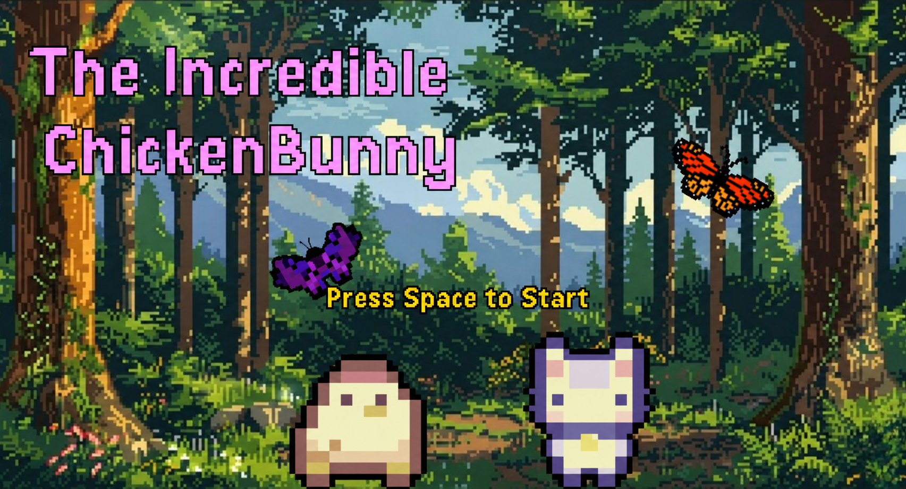

<h1 align="center">不可思议的鸡兔大战</h1>

<h3 align="center">
  COMSM0166 (2026) · 第20组
</h3>

<p align="center">
不可思议的鸡兔大战：一款激动人心的多人平台竞技游戏，玩家选择地图障碍物并竞速冲向终点。
</p>

<h3 align="center"> 点击 <a href="https://uob-comsm0166.github.io/2026-group-20/main-game/"> 这里</a> 在线体验最新版本 </h3>

<hr style="border: none; height: 0.5px; background-color:#ddd;">

## 快速开始

### 环境要求

- **Node.js**：版本 18 或更高（项目使用 `.nvmrc` 指定版本）
- **npm**：随 Node.js 一同安装

### 安装步骤

```bash
# 1. 克隆或下载项目到本地
# 2. 进入项目目录
cd 2026-group-20-main

# 3. 安装依赖
npm install
```

### 启动游戏

```bash
# 启动开发服务器（默认端口 5173）
npm run dev
```

启动后终端会显示类似以下信息：
```
  VITE v7.x.x  ready in xxx ms

  ➜  Local:   http://localhost:5173/
```

在浏览器中打开显示的地址即可开始游戏。

### 关闭游戏

在终端中按 **Ctrl + C** 即可停止开发服务器。

### 下次启动

```bash
# 进入项目目录后直接运行
npm run dev
```

### 其他命令

```bash
npm run build      # 构建生产版本
npm run preview    # 预览构建结果
npm run test       # 运行测试
npm run lint       # 代码检查
npm run prettier   # 代码格式化
```

<hr style="border: none; height: 0.5px; background-color:#ddd;">

## 游戏概述

**不可思议的鸡兔大战** 是一款 **2人本地多人平台竞技游戏**，灵感来源于《Ultimate Chicken Horse》。核心玩法是：两位玩家轮流在地图上放置障碍物来阻挠对手，同时自己要竞速到达终点。

### 游戏特色

- **双人本地对战**：支持2名玩家同屏竞技
- **策略性障碍放置**：从商店购买陷阱，在地图上巧妙布置
- **随机地图生成**：每轮比赛前自动生成全新地图，保证新鲜感
- **经济系统**：收集金币、赚取奖励、在商店消费
- **多轮制**：共5轮比赛，累积金币最多的玩家获胜
- **4个可选角色**：小鸡、兔兔、企鹅、北极熊
- **2张主题地图**：森林与冰原
- **15种障碍物**：平台、陷阱、特殊效果道具

<hr style="border: none; height: 0.5px; background-color:#ddd;">

## 操作说明

| | 玩家1 (P1) | 玩家2 (P2) |
|--|----|----|
| 左移 | A | ← |
| 右移 | D | → |
| 跳跃 | W | ↑ |
| 二段跳 | 空中再按 W | 空中再按 ↑ |

### 其他操作

- **ESC**：暂停游戏 / 返回
- **回车**：确认 / 进入下一阶段
- **右键**：在布置阶段撤销放置
- **R 键**：旋转炮台/风域方向
- **D 键**：切换开发者模式
- **双击**：切换全屏

<hr style="border: none; height: 0.5px; background-color:#ddd;">

## 游戏流程

### 整体循环（共5轮）

```
启动 → 主菜单 → 角色选择 → 地图选择 → 教程 → [第1轮直接开始比赛]
比赛 → 结算 → 商店 → 布置障碍 → 比赛 → 结算 → 商店 → ...（重复5轮）
第5轮结算后 → 最终排行榜 → 返回主菜单
```

### 阶段详解

#### 1. 主菜单
- 按 **空格键** 开始游戏
- 点击 **教程** 查看操作说明
- 点击 **设置** 调整显示模式和AI地图生成

#### 2. 角色选择
- P1先选，P2后选，轮流进行
- 4个角色各有不同风格（当前版本属性差异为展示性）
- 选择角色后需输入昵称（最多12字符）

#### 3. 地图选择
- 两位玩家操控角色走入传送门投票选择地图
- 左传送门 = 森林地图，右传送门 = 冰原地图
- 两人进入同一传送门后自动进入下一阶段

#### 4. 教程
- 两页教程：操作说明 + 游戏流程说明
- 比赛中按 ESC 暂停也可随时查看

#### 5. 布置障碍（BUILD）
- P1先放置，按回车确认；P2再放置，按回车确认
- 第1轮跳过此阶段（因为还没有购买障碍物）
- 从下方面板选择障碍物，点击地图放置
- 右键可撤销本轮放置的障碍物

#### 6. 比赛（RUN）
- **倒计时120秒**
- 从起点出发，穿越障碍，收集金币，到达终点旗帜
- 死亡后2秒重生回起点，本轮金币丢失
- 到达终点按顺序获得奖励金

#### 7. 结算（RESULTS）
- 显示排行榜：排名、状态、用时、死亡数、金币、钱包
- 按 L 键查看历史排行榜

#### 8. 商店（SHOP）
- 轮流购买障碍物代币
- 每轮随机展示8种障碍物
- 买完点击"完成购物"

<hr style="border: none; height: 0.5px; background-color:#ddd;">

## 障碍物一览

| 类型 | 名称 | 价格 | 效果 |
|------|------|------|------|
| 实心 | 平台 | 3金 | 可站立的实心方块 |
| 实心 | 移动平台 | 6金 | 来回移动的平台 |
| 实心 | 坠落平台 | 5金 | 站上后坠落 |
| 实心 | 冰面平台 | 4金 | 湿滑实心平台 |
| 实心 | 弹跳垫 | 5金 | 向上弹飞玩家 |
| 致命 | 尖刺 | 5金 | 触碰即死 |
| 致命 | 炮台 | 8金 | 定时发射炮弹 |
| 致命 | 锯子 | 7金 | 旋转刀刃 |
| 致命 | 火焰 | 6金 | 周期性喷火 |
| 致命 | 刺球 | 7金 | 静态危险球 |
| 特殊 | 冰块 | 4金 | 穿行加速 |
| 特殊 | 风域 | 6金 | 定向推力 |
| 特殊 | 传送器 | 10金 | 一对传送门 |
| 特殊 | 炸弹 | 8金 | 近距引爆 |
| 特殊 | 影子 | 9金 | 重放5秒轨迹 |

<hr style="border: none; height: 0.5px; background-color:#ddd;">

## 角色介绍

| 角色 | 特点 | 最大跳跃 |
|------|------|---------|
| 小鸡 | 均衡全能选手 | 2段跳 |
| 兔兔 | 三段跳，轻盈飘逸 | 3段跳 |
| 企鹅 | 疾速飞毛腿 | 2段跳 |
| 北极熊 | 沉稳厚重型 | 2段跳 |

<hr style="border: none; height: 0.5px; background-color:#ddd;">

## 经济系统

```
比赛收集金币 ──→ 本轮金币（死亡丢失）
                  ↓
到达终点 ──→ 本轮金币 + 名次奖励 = 存入钱包
未到达终点 ──→ 本轮金币清零，钱包不变
                  ↓
商店消费 ──→ 钱包金币购买障碍物代币（跨轮保留）
```

**名次奖励**：第1名 20金、第2名 10金、第3名 5金、第4名 2金

<hr style="border: none; height: 0.5px; background-color:#ddd;">

## 视频演示

[](https://youtu.be/pQogMnpL4lI)

<hr style="border: none; height: 0.5px; background-color:#ddd;">

## 小组成员

<div align="center">
  
</div>


| 姓名       | 邮箱                              | 角色                                                     | GitHub 账号 
| ---------- | ---------------------------------- | -------------------------------------------------------- | ----------------
| Megi       | jd25841@bristol.ac.uk              | 开发、平面设计、UI设计、音频管理 | <a href= "https://github.com/mgbego"> mgbego
| Maran      | ilamaran.magesh.2025@bristol.ac.uk | 开发、AI工程师、构建工程师                   | <a href= "https://github.com/IlamaranMagesh"> IlamaranMagesh
| Jacqueline | oz25232@bristol.ac.uk              | 开发、平面设计、UI设计、音频管理 | <a href= "https://github.com/liilee111"> liilee111
| Jinwang    | ut25234@bristol.ac.uk              | 开发、UX设计、音效设计                   | <a href= "https://github.com/Arupin-uk"> Arupin-uk
| Mengxiao   | dh25275@bristol.ac.uk              | 开发、UI设计、关卡设计                   | <a href= "https://github.com/MengW7"> MengW7
| Eira       | xz25553@bristol.ac.uk              | 开发、UX设计、音效设计                   | <a href= "https://github.com/Libing42024"> Libing42024


<hr style="border: none; height: 0.5px; background-color:#ddd;">

## 项目报告

### 目录
- [1. 引言](#1-引言)
- [2. 需求分析](#2-需求分析)
  - [2.1 创意构思与游戏选择](#21-创意构思与游戏选择)
  - [2.2 利益相关者](#22-利益相关者)
  - [2.3 史诗故事](#23-史诗故事)
  - [2.4 系统需求](#24-系统需求)
  - [2.5 用户故事](#25-用户故事)
  - [2.6 用例图](#26-用例图)
- [3. 设计](#3-设计)
  - [3.1 系统架构概览](#31-系统架构概览)
  - [3.2 实体](#32-实体)
  - [3.3 系统](#33-系统)
  - [3.4 状态](#34-状态)
  - [3.5 用户界面](#35-用户界面)
  - [3.6 资源管理器](#36-资源管理器)
- [4. 实现](#4-实现)
  - [4.1 整体实现](#41-整体实现)
  - [4.2 技术挑战1：随机地图生成](#42-技术挑战1随机地图生成)
  - [4.3 技术挑战2：碰撞与物理系统](#43-技术挑战2碰撞与物理系统)
- [5. 评估](#5-评估)
  - [5.1 定性评估](#51-定性评估)
  - [5.2 定量评估](#52-定量评估)
  - [5.3 测试](#53-测试)
- [6. 开发流程](#6-开发流程)
- [7. 可持续性、伦理与无障碍](#7-可持续性伦理与无障碍)
- [8. 总结](#8-总结)
- [9. 贡献声明](#9-贡献声明)
- [10. AI使用声明](#10-ai使用声明)

<hr style="border: none; height: 0.5px; background-color:#ddd;">

## 1. 引言

**不可思议的鸡兔大战** 是一款全新开发的多人平台竞技游戏，改编自 **Ultimate Chicken Horse**。原作因其独特的多人机制被选为灵感来源——玩家从游戏内商店中策略性地选择障碍物并放置在地图上，以获得优势的同时让赛道对对手更加困难。这种玩法在合作与竞争之间创造了动态平衡，使游戏充满吸引力。

在开发过程中，我们保留了这些核心元素，同时引入了新的游戏和视觉设计增强功能：

- **两个主题环境**：森林和冰原，各有专属角色
- **金币与钱包系统**：增加竞争性和玩家参与度
- **强制计时器**：增加紧张感和高风险性
- **随机地图生成**：每轮生成新骨架地图，防止玩家预测布局

## 2. 需求分析

### 2.1 创意构思与游戏选择

团队成员各自提出5-9个喜爱的游戏创意，经过会议讨论，聚焦于 **并发性** 和 **AI** 两个关键挑战，最终从 **Ultimate Chicken Horse** 和 **Among Us** 中选择了前者，因为它能提供更全面、有趣的游戏体验。

### 2.2 利益相关者

- **玩家**：主要用户，期望引人入胜的游戏体验
- **讲师**：主要评估者，评估设计过程和技术实现
- **其他同学**：同行测试者，提供Bug和可用性反馈

### 2.3 史诗故事

| 利益相关者 | 史诗需求 |
|:---:|:--- |
| 玩家 | 复古视觉风格、新增玩法、视觉设计、音效、核心功能（钱包、排行榜、教程）、良好UX |
| 讲师 | 学习概念整合、技术挑战展示、可达成性、有效协作、持续进展、原创性 |
| 同学 | 社交功能、易上手、短时游戏 |

### 2.4 系统需求

**功能需求**

| ID | 类别 | 需求 |
|:---:|:---:|:--- |
| FR-1 | 输入 | 两名玩家可左右移动和跳跃。P1使用WASD，P2使用方向键 |
| FR-2 | 物理 | 系统应检测玩家与障碍物的碰撞 |
| FR-3 | 经济 | 游戏应实现钱包系统追踪每位玩家收集的金币 |
| FR-4 | 排行榜 | 游戏应显示排行榜追踪玩家进度 |
| FR-5 | 商店 | 游戏应提供商店让玩家用游戏币购买障碍物 |
| FR-6 | 重生 | 玩家死亡时系统应重置到起始位置 |
| FR-7 | 背包 | 游戏应允许玩家在布置阶段从背包中选择障碍物 |
| FR-8 | 地图 | 游戏应包含多张地图 |
| FR-9 | 教程 | 游戏应提供教程介绍基本玩法 |

**非功能需求**

| ID | 类别 | 需求 |
|:---:|:---:|:--- |
| NFR-1 | 视觉 | 游戏应具有复古风格视觉效果 |
| NFR-2 | 音频 | 游戏应包含背景音乐增强沉浸感 |
| NFR-3 | 可用性 | 游戏界面对新玩家应易于理解 |
| NFR-4 | 性能 | 游戏应保持流畅运行无明显卡顿 |

### 2.5 用户故事

**学生**
- 作为学生，我希望游戏有多人模式，这样我可以和朋友一起玩
- 作为学生，我希望游戏操作直观，这样我可以马上开始玩
- 作为学生，我希望每局游戏足够短，这样我可以在课间玩

**讲师**
- 作为讲师，我希望游戏清晰展示编程概念的应用
- 作为讲师，我希望游戏包含可衡量的挑战
- 作为讲师，我希望看到明确的团队协作证据

**玩家**
- 作为玩家，我想要排行榜来追踪表现
- 作为玩家，我想要简短的交互教程
- 作为玩家，我想要直观的菜单和清晰的导航
- 作为玩家，我想要响应式的音效和视觉反馈

### 2.6 用例图

主要参与者是 **玩家**，可执行核心操作如开始游戏、查看教程、移动角色、放置障碍物、收集金币、到达终点等。**AI求解器** 作为次要参与者，负责在请求时生成障碍物推荐。

## 3. 设计

### 3.1 系统架构概览

项目采用 **实体-组件-系统（ECS）架构** 与 **面向对象设计** 的混合方法。玩家是存储数据的实体，而系统处理物理和重生等机制。部分游戏逻辑（如玩家移动）仍保留在玩家对象内部。

### 3.2 实体

实体代表游戏世界中的主要对象（玩家、金币、障碍物），存储位置、速度和状态信息，同时实现部分游戏逻辑。

### 3.3 系统

系统负责处理与不同实体相关的行为，实现核心游戏机制：
- **物理系统**：碰撞检测与解决
- **分数管理器**：金币、钱包、排名
- **重生管理器**：死亡与重生队列
- **时间管理器**：倒计时与完成记录
- **暂停管理器**：暂停状态管理

### 3.4 状态

游戏使用 **有限状态机** 控制流程，主要状态包括：
- `BootState`：启动加载
- `MenuState`：主菜单
- `CharSelectState`：角色选择
- `WalkMapState`：地图选择
- `TutorialState`：教程
- `BuildState`：障碍物布置
- `RunState`：比赛进行
- `ResultsState`：结算排行
- `ShopState`：道具商店

### 3.5 用户界面

用户界面管理层与游戏逻辑分离，包括HUD、分数指示器、计时器等元素。

### 3.6 资源管理器

游戏实现资源管理器处理资产加载和释放。`MapLoader` 读取地图配置文件生成游戏对象。

## 4. 实现

### 4.1 整体实现

采用 **p5.js 实例模式** 避免全局命名空间冲突。同时建立了 **CI/CD 流水线** 维护代码质量：Husky 预提交钩子运行lint和测试，GitHub Actions 自动构建和部署到 GitHub Pages。

### 4.2 技术挑战1：随机地图生成

设计了结合AI和程序化生成的系统：
- 创建预制地图块库，每个块经过内部可玩性测试
- 完整地图由12个块组装而成
- 命名规范编码主题、类型和难度信息
- AI组件提供多样性，程序化系统作为可靠后备

### 4.3 技术挑战2：碰撞与物理系统

实现了支持多种障碍物行为的碰撞与物理系统：
- AABB碰撞检测
- 基于瓦片的平台物理
- 单向半平台和斜坡瓦片支持
- 玩家间碰撞解决
- 碰撞处理顺序：水平移动 → 瓦片碰撞 → 障碍物碰撞 → 障碍物效果

## 5. 评估

### 5.1 定性评估

采用 **有声思维法** 和 **启发式评估**：
- 20名参与者边玩边说出想法
- 基于尼尔森可用性启发式进行评估
- 主要发现：视觉引导不足、操作说明缺失、目标识别困难

### 5.2 定量评估

采用 **SUS（系统可用性量表）** 和 **NASA-TLX（任务负荷指数）**：
- 基础版SUS得分70.75，困难版64.25
- 困难版工作负荷显著高于基础版（p=0.032）
- 心理需求、努力和挫败感维度差异显著

### 5.3 测试

采用 **白盒测试** 方法，覆盖输入处理、物理系统、分数管理、时间管理、重生管理和碰撞检测。

## 6. 开发流程

- **敏捷方法**：两周冲刺周期
- **结对编程**：三对组合持续同行评审
- **轮换Scrum Master**：每冲刺轮换协调员
- **水平开发策略**：先实现多系统简化版本，再逐步完善
- **分支策略**：main → dev → feature分支，所有合并需PR审查

### 冲刺概览

| 冲刺 | 日期 | 目标 | 关键任务 |
|:---:|:---:|:---:|:---|
| 1 | 2/15-3/1 | 初始原型 | 项目搭建、CI/CD、基础移动、胜负检测、起始画面 |
| 2 | 3/2-3/16 | 核心玩法 | HUD、奖励算法、角色动画、地图设计、金币系统 |
| 3 | 3/17-3/30 | 功能扩展 | 双地图、商店系统、音频实现、UI改进 |
| 4 | 3/31-4/13 | 测试优化 | Bug修复、AI地图生成、教程 |
| 5 | 4/14-4/24 | 最终打磨 | 音效、地图设计优化、最终部署 |

## 7. 可持续性、伦理与无障碍

从 **卡尔斯克鲁纳宣言** 角度分析了环境、经济、技术、个人和社会五个维度的可持续性影响。遵循 **绿色软件基金会** 实现模式：使用高效AI框架、利用预训练模型、采用JSON高效文件格式。

## 8. 总结

本项目是一次宝贵的学习体验，不仅在技术上取得了进展，也深化了团队对软件开发的理解。未来发展方向包括：在线版本支持、服务器托管、多设备兼容、应用商店发布、用户账户和全球排行榜。

## 9. 贡献声明

| 姓名 | 功能 | 个人权重 |
|------|------|---------|
| Megi | 动画、移动机制、视觉设计、报告撰写 | 1.0 |
| Jacqueline | 动画、移动机制、视觉设计、报告撰写 | 1.0 |
| Maran | CI/CD流水线、AI地图生成 | 1.0 |
| Jinwang | 碰撞检测、UX（音效、教程、排行榜、钱包系统）、障碍物物理、状态管理、视频设计 | 1.0 |
| Mengxiao | 程序化地图生成、状态管理 | 1.0 |
| Eira | 碰撞检测、UX（音效、教程、排行榜、钱包系统）、视频设计 | 1.0 |

## 10. AI使用声明

我们确认使用了 ChatGPT 和 Copilot 作为辅助工具：
- **教育用途**：帮助理解不熟悉的概念和技术方法
- **调试重构**：识别错误源、建议改进、重构代码
- **视觉设计**：背景PNG和视频动画使用AI生成
- **语言润色**：Copilot用于README语言校对

所有AI辅助贡献均经过团队成员批判性评估、调整和验证。

### 参考文献

[1] J. Joe et al., "The use of think-aloud and instant data analysis in evaluation research," J. Biomed. Inform., vol. 56, pp. 284–291, Aug. 2015.

[2] "A comparison of heuristics applied for studying the usability of websites," Procedia Comput. Sci., vol. 176, pp. 3571–3580.

[3] J. Nielsen, "10 Usability Heuristics for User Interface Design," Nielsen Norman Group, Apr. 24, 1994.

[4] K. Chaudhary, X. Dai, and J. Grundy, "Experiences in Developing a Micro-payment System for Peer-to-Peer Networks," Int. J. Inf. Technol. Web Eng., vol. 5, no. 1, pp. 23–42, Jan. 2010.

[5] J. Gregory, Game Engine Architecture. CRC Press, 2017.

[6] F. Pouhela et al., "Entity Component System Architecture for Scalable, Modular, and Power-Efficient IoT-Brokers," in 2023 IEEE 21st INDIN, Jul. 2023.

[7] J. Brooke, "SUS: A 'Quick and Dirty' Usability Scale," in Usability Evaluation In Industry, CRC Press, 1996, pp. 207–212.

[8] "p5," p5.js. [Online]. Available: https://p5js.org/reference/p5/p5/

[9] G. Booch et al., Object-Oriented Analysis and Design with Applications, 3rd ed. Addison-Wesley, 2007.

[10] I. F. Alexander, "A taxonomy of stakeholders: Human roles in system development," Int. J. Technol. Human Interact., vol. 1, no. 1, pp. 23–59, 2005.

[11] "sustainabilitydesign." [Online]. Available: https://sustainabilitydesign.org/

[12] "Green Software Patterns." [Online]. Available: https://patterns.greensoftware.foundation/
